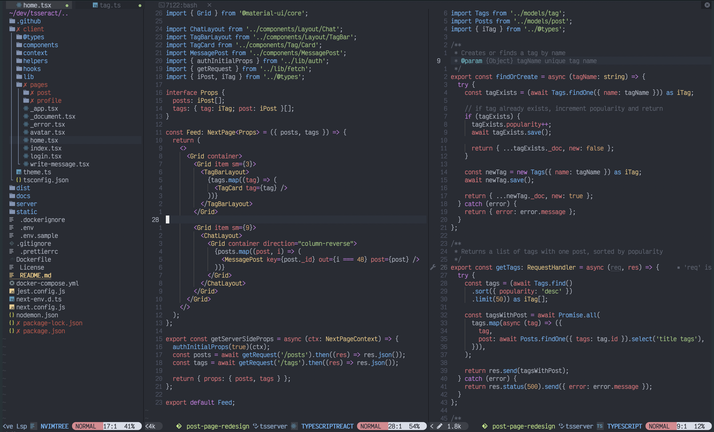

<h1 align="center">NeoVim</h1>

<div align="center">
  

  <p>Custom, easy-to-install NeoVim configuration :rocket:</p>
</div>

### Installation

:pushpin: You need [brew](https://brew.sh/) installed to be able to install most of the tools for this config.

1. Use brew to install required programs: `./brew.sh`

2. Install Packer Package Manager:

```bash
git clone https://github.com/wbthomason/packer.nvim\
~/.local/share/nvim/site/pack/packer/start/packer.nvim
```

3. Install the config files: `git clone git@github.com:jeremy2918/nvim.git ~/.config/nvim`

4. Install the nvim plugins: `nvim --headless +PackerInstall && nvim --headless +TSUpdate`

5. Use npm to install the language servers: `./npm.sh`

### Design



### TODO

- Add snippets to autocompletion menu

- Python LSP

- Set up prettier

- LSP to avoid importing with file type
